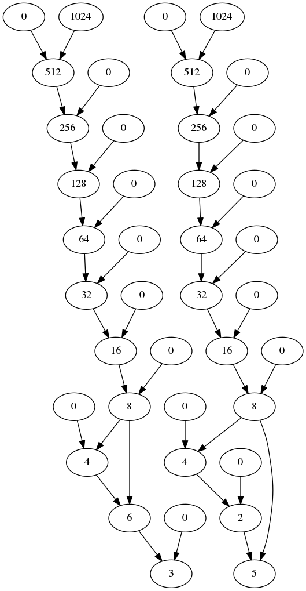

#Graphviz
##安装

	sudo apt-get install graphviz
##使用

	dot -T<type> -o<outfile> <infile.dot>
	输入文件是<infile.dot>，生成的格式由<type>指定，生成的文件是<outfile>。
	其中-T<type>包括：
	-Tps (PostScript),
	-Tsvg -Tsvgz (Structured Vector Graphics), 
	-Tfig (XFIG  graphics), 
	-Tmif  (FrameMaker graphics),
	-Thpgl (HP pen plotters),
	-Tpcl (Laserjet printers),
	-Tpng -Tgif (bitmap graphics),
	-Tdia (GTK+ based diagrams),
	-Timap (imagemap files for httpd servers for each node or edge  that  has a non-null "href" 	attribute.),
	-Tcmapx (client-side imagemap for use in html and xhtml).
##本周工作
首先安装了Graphviz，是一个使用dot语言编程生成图片的工具
简单学习了dot语言
简单实现了一个根据算法生成的文件自动编写dot文件的python脚本，还需要进一步完善。
已经实现0和其他浓度混合，还需要再支持其他浓度的混合。
美化还没有做，但是只能换点的颜色形状和线的颜色形状，论文实例上的每一层虚线还有两边的"step n"、"/2048"等加不上去.
下面是一个生成实例
